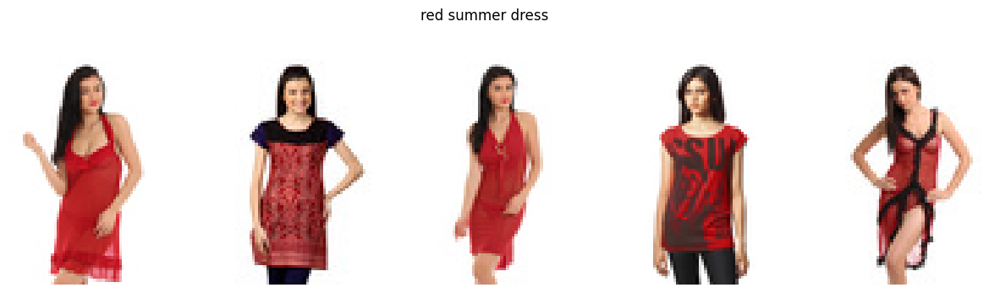

# Fashion-CLIP: Text-to-Image Retrieval for Fashion Products

This project implements a **CLIP-based vision–language model** fine-tuned for **fashion image retrieval**.  
Given a natural-language query (e.g. *“red summer dress”*), the model retrieves the most relevant fashion images.

The project demonstrates:
- multimodal learning (image + text)
- contrastive training
- real-world dataset handling
- retrieval-based evaluation

# Project Overview

Traditional image classification assigns fixed labels.  
**CLIP (Contrastive Language–Image Pretraining)** learns a shared embedding space between images and text.

This allows:
- text-to-image retrieval
- zero-shot generalization
- semantic search without explicit class labels

This project fine-tunes CLIP on a **fashion dataset** to improve retrieval performance for clothing items.

# Dataset

- **Source**: Fashion Product Images Dataset
- **Content**:
  - Product images
  - Product display names
  - High-level categories

# Preprocessing
- Removed samples with missing images
- Generated natural-language captions
- Subsampled 10,000 high-quality image–text pairs

# Model

- **Base model**: `openai/clip-vit-base-patch32`
- **Architecture**:
  - Vision Transformer (ViT)
  - Text Transformer
- **Training objective**:
  - Bidirectional contrastive loss (InfoNCE)

# Training Details

- Framework: PyTorch + Hugging Face Transformers
- Optimizer: AdamW
- Learning rate: 5e-5
- Batch size: 32
- Epochs: 3
- Checkpointing enabled (resume safe)

# Training Loss
| Epoch | Avg Loss |
|-----|----------|
| 1 | 0.842 |
| 2 | 0.426 |
| 3 | 0.324 |

Loss decreases smoothly, indicating successful vision–language alignment.

# Retrieval Results

Example queries:

| Query | Result |
|-----|------|
| *“red summer dress”* | ✅ Red dresses retrieved |
| *“blue denim jeans”* | ✅ Denim jeans retrieved |
| *“men formal black shoes”* | ✅ Formal shoes retrieved |

Example output:

